# IoT_Individual_assignment
Individual assigment of the IoT Algorithm and Services course in Spienza Engineering in Computer Science and artificial Intelligence 
## Introduction
The purpose of the project is to design an IoT system capable to adapt its sampling rate to the simulated environment, compute some aggregation function and comunicate the value over the network using two comunication standard for IoT: TTN over LoRa and MQTT over WiFi.
The performance evaluation is a crucial part of this report because enlight the capability of the system to meet requirements.
### Goal

## Requirements Mapping

The following table explicitly maps the assignment requirements to the implemented components of the system.

| Requirement                               | Implementation                                                      | Reference Section                   |
| ----------------------------------------- | ------------------------------------------------------------------- | ----------------------------------- |
| Maximum sampling frequency identification | Empirical evaluation using FreeRTOS task timing (`xTaskDelayUntil`) | Maximum Frequency                   |
| Adaptive sampling using FFT               | `arduinoFFT` + dynamic threshold peak detection                     | Identify Optimal Sampling Frequency |
| Aggregate computation                     | Tumbling window mean (fixed 64 samples)                             | Computing over a Window             |
| MQTT communication                        | JSON payload over WiFi using HiveMQ broker                          | MQTT Sending                        |
| LoRaWAN communication                     | TTN integration using Heltec ESP32 LoRa V3                          | LoRaWAN + TTN Sending               |
| Energy measurement                        | INA219 current monitoring                                           | Energy Saving                       |
| Execution time measurement                | `esp_timer_get_time()`                                              | Per Window Execution Time           |
| Network traffic analysis                  | Wireshark + analytical model                                        | Network Traffic                     |
| End-to-end latency                        | RTT-based measurement using MQTT feedback loop                      | Latency                             |
| Noise and anomaly filtering (bonus)       | Z-score and Hampel filters                                          | Bonus Section                       |

### System design
My principal goal was to have system that was "_plug and play_", so that once setup would produce the necessary data to be then fully analized an reproducible.
#### Test
To achive the flexibilty I used a specific struct called profileRuntime that defines the condition of the sunning system using the following parameters:
| parameter | values |
| -- | -- |
| adaptive sampling | `{true, false}` |
| is noise enabled  | `{true, false}` |
| is filter enabled | `{true, false}` |
| filter type       | `{hampel, z-score` |
| spike probability | `{1%, 5%, 10%}` |
| filter window size| `{5, 15, 31} *`| 
*samples
#### Test Execution | 

* Each configuration (profileRuntime) was executed for the duration of FFT window 
* Reported values represent **mean averages**

#### Measurement Setup

* **Energy**: measured using INA219 sensor

  * Sampling frequency: ~100 Hz
  * External stable power supply used
* **Timing**:

  * Microsecond precision via `esp_timer_get_time()`
* **Network**:

  * WiFi tests performed in stable indoor environment
  * MQTT broker: HiveMQ (remote)


#### Software
The task design is implemented with the purpose to be completely modular, so every task has its own purpose. The communication between tasks is handled by queue, notification and global variables.
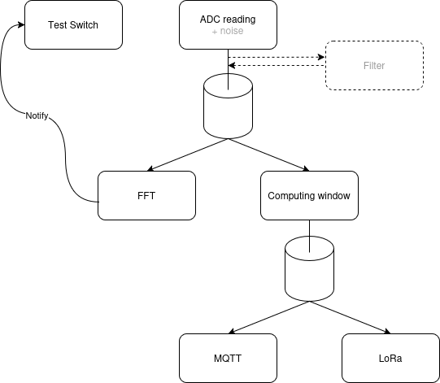

The architecture diagram shows a linear data pipline. The data starts from the read task which can optionally add noise to accomplish bonus part, optionally are also routed to the filter and then both to the computing window task and fft task. The compiting window result is then sent via LoRa and via MQTT.
When the fft task terminates its execution triggers the next test by changing the profile runtime and notifying the change trough a GPIO to the monitor.

#### Hardware
The system is composed of an ESP32 heltec LoRa V3 that act as a supervisor, a ESP32 Wroom-32 that act as signal generator and monitor, an Ina219 and an exteernal power source.
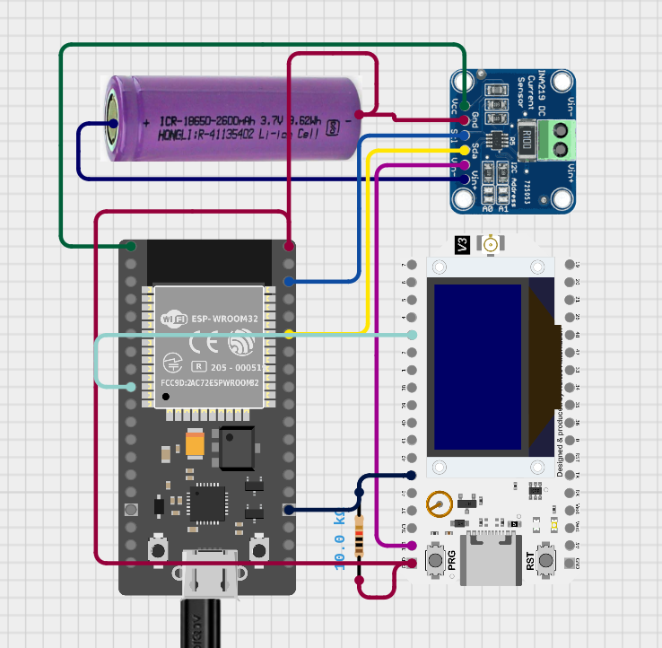

The two wires directly connectng the tow esp are: The signal wire which is connected beteen DAC of the generator and ADC of the sample. In the other direction there is a digital connection that enable the sampler to comunicate when a test is ended to the monitor. A pullup resistor is added to avoid interference in booting te sampler.

## Computation
Here is presented the computing part of the project
### Maximum frequency
The oversampling frequency is obtained using doing manual tuning using this code:
```C
static void adcReadTask(void* pvParameters) {
  (void)pvParameters;
  adc1_config_width(ADC_WIDTH_BIT_12);
  adc1_config_channel_atten(ADC1_CHANNEL_1, ADC_ATTEN_DB_11);
  uint16_t latestAdcSample = 0;
  for (;;) {
    const uint32_t sampleIntervalMs =
        gAdaptiveSamplingEnabled ? gAdaptiveSamplingIntervalMs : BASE_SAMPLING_INTERVAL_MS;
    gSamplingFrequencyHz = (sampleIntervalMs > 0) ? (1000UL / sampleIntervalMs) : 0;
    //for(int i = 0; i < SAMPLES; i++){
      TickType_t st = xTaskGetTickCount();
      latestAdcSample = adc1_get_raw(ADC1_CHANNEL_1);

      uint16_t sampleForPipelines = latestAdcSample;
      bool isSpikeContaminated = false;
      //Serial.printf(">prenoise:%d\r\n",sampleForPipelines);
      if (gNoiseEnabled) {
        sampleForPipelines = static_cast<uint16_t>(
            addSyntheticNoise(static_cast<int32_t>(latestAdcSample), &isSpikeContaminated));
      }
      adc_sample_packet filterPacket = {
          .value = sampleForPipelines,
          .isSpikeContaminated = isSpikeContaminated,
      };
      xQueueSend(sFftSampleOutputQueue, (void *)&filterPacket, 0);
      BaseType_t ret = xTaskDelayUntil(&st, pdMS_TO_TICKS(sampleIntervalMs));
      if (ret == pdFALSE)
      {
        Serial.println("[ADC] error, could not make it");
      }
    //}
  }
}
```
This code is the exact transposition of the one used in the project, this code allow us to know wheter the task completed the cycle in the determined time, in this way we can know exactly if the system is capable of sampling at higher frequency. The obtained frequency is 500Hz.
If it was the only running task without the overhead of building the packet and adding noise it would reach also 1000Hz. 
There are also other solution to obtain much higher frequency using DMA in order to free the processor.

### Identify the optimal sampling frequency
Using the arduinoFFT library it is easy to implement the FFT, it is harder to compute the maximum sampling frequency. 
The library provides a method to obtain the frequency with teh highest magnitude which is not necessarily the higher frequency we're intrested in.
So to compute the maximum sampling frequency I use a dynamic treshold:

$$\text{threshold} = \text{mean} \times 5 \times \frac{\text{SAMPLES}}{\text{sampling frequency}}$$

The `SAMPLES` is the dimension of the buffer of the FFT. The division determines the "_precision_" of the FFT, the dimension of the bins, the more bins there are the more the load would be distributed between the bins because of the fact that there is no necesarily the bin for that exact frequency.
This gave me the idea of tuning the treshold dynamically to be higher if the precision is lower.

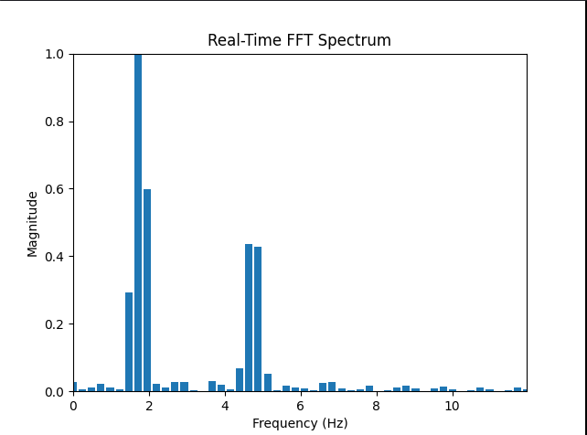

This is the result obtained using the tool `fft_plotter.py`.
The code outputs:

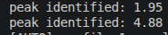

In this case the optimal frequency is 10Hz.

### Computing over a window function
The average value is computed using a tumbling window of the size of 64 samples. I chose a thumbling window of a fixed size of sample because it is more interesting from the point of view of the network traffic related to the sampling frequency.

```C
static void computeWindowTask(void* pvParameters) {
  (void)pvParameters;

  uint32_t mean = 0;
  int cnt = 0;
  uint16_t sample;
  uint32_t windowStartUs = 0;
  telemetry_packet packet;

  for (;;) {
    xQueueReceive(sInputQueue, (void*)&sample, pdMS_TO_TICKS(portMAX_DELAY));
    if (cnt == 0) {
      windowStartUs = esp_timer_get_time();
    }

    cnt++;
    mean += sample;

    if (cnt == WINDOWSIZE) {
      packet.mean = static_cast<uint16_t>(mean / cnt);
      packet.windowExecUs = esp_timer_get_time() - windowStartUs;
      xQueueSend(sWifiOutputQueue, &packet, 0);
      xQueueSend(sLoraOutputQueue, &packet, 0);
      //ESP_LOGI("WINDOW TASK", "sent data");
      cnt = 0;
      mean = 0;
    }
  }
}
```
The function to compute iteratively add the value to the sum of value until the windowsize is reached, then the value is transmitted.
The excution time is calculated and sent at the same time.

### MQTT sending
In order to have a one shot test system MQTT has been used as the receiver of all teh useful data, the JSON schema is available in the appendix.
The schema contains every useful data also for the bonus part which make the overhead bigger. Also latency is calculated using MQTT and so the timestamp of the sending is embedded into the payload.

The data are publieshed to the topic `tzn/data`. The client is also subscribed to the topic `tzn/time`, this is used to receive back the message with the ID of the message and some new timestamps used to calculate the latency.

The broker used is [hiveMQ](https://www.hivemq.com)

The receiver is in locale, uising paho.mqtt library I implemented a program that stores all the received data into a csv file to analyze everything.

### LoRaWan + TTN sending
In order to send the values to the lora I registered the device to the [TTN](https://eu1.cloud.thethings.network) and removed the nonce verification in order to connect multiple times with the same nonce. This is not a good practice of security, used for demo purpose only. 

## System performance
The core section of the report is the measure of the performance of the system.
### Energy saving
The adaptive sampling function is to make the system to save energy and avoid sampling unnecessary data.
In order to achive a consistent energy saving I used the esp-idf + arduino framework in platformio.
The result are satisfying:

**non adaptive sapling**

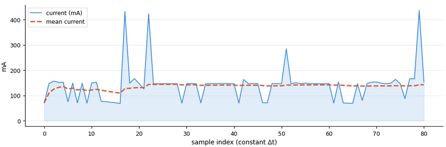

**adaptive sampling**

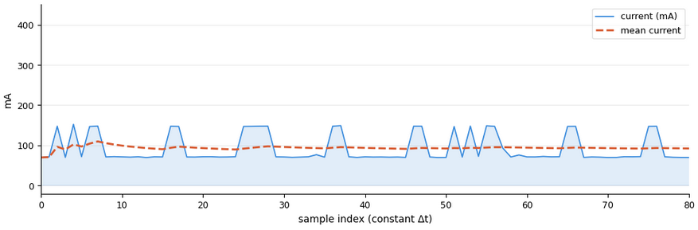

We can clearly see a basline in common but the non adaptive one rarely hit the baseline while the adaptive one has longer period in which its activity is around 70Hz which look the minimum amount of current consumed.

The numerical result is the following:

| mode | mean |
| --   | --   |
| oversampling | 142.6494 |
| adaptive sampling | 89.6178 |

Which is 40% less consuming.
### Per window execution time
The window execution time is computed as shown in the computing section, basically every first sample of a window is taken and at the end it the difference is calculated.
| frequency |	total (µs) |
| --  |  -- | 
|10 Hz |	6149756.660000 |
|500 Hz|	124750.090000  |
### Latency
To calculate latency I applied the following method: inside the MQTT payload there is a timestamp embedded called `t1`. When the client receives the message takes a timestamp `t2`, process the data and sends back the message with the id field, `t1`,`t2` and `t3` which is the moment of the sending back. The sampler receives back the message and computes the following result:
$\text{RTT} = (t_4 - t_1 ) - (t_3 - t_3)$

The RTT is just a part of the latency, since a sampled is taken there are other things that influences the arrival of the message, the filter computing time and the window computing time. For this first part the filter is not present but the window computing time it is so we have a mean latency of:

| frequency |	RTT/2 (µs) |	window exec time (µs) |	total (µs) |
| --  | -- | -- | -- | 
|10 Hz |	121362.220000 |	6149756.660000 | 	6271118.880000|
|500 Hz| 	115852.470000 |	124750.090000  |	240602.560000 |

### Network traffic
The network traffic is given by the following folrmula:
$\text{traffic} = (\text{payload} + 2\text{MQTT overhead} + \text{response}) \times \frac{\text{sampling freq}}{windowsize}$
So it varies only based on the sampling frequency.

**wireshark capture for payload size**
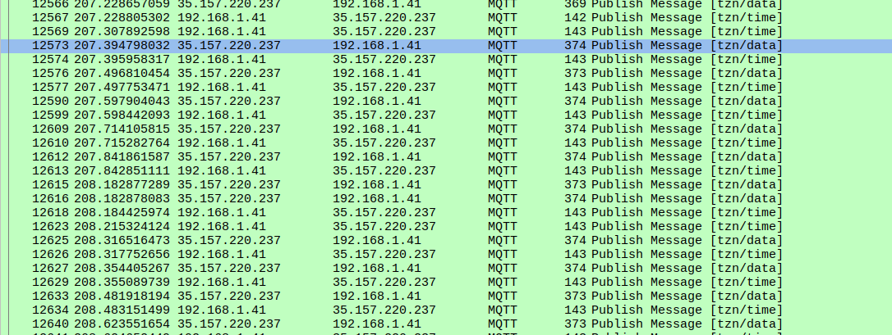

From this capture we can understand that an exchange of messages is about 520bytes so we obtain:

| frequency (Hz) | network flow (bytes)|
| -- | -- | 
| 10 |  81  |
| 500 | 4062.5  |

Which is completely due to the proprtion fo the sampling frequency.

## Bonus section
The bonus section is about showing the system to be reliable also for different types of signal than the chosen one.
To evaluate how a noise impact the performance and how a filter may mitigate the problem derived from a noise.
### Other signals
As alternative signals I tried to vary the amplitude and the proximity of the sine waves. I chose:
- $\sin(2 \pi 3t) + 0.15\sin(2 \pi 4t)$
- $0.5\sin(2 \pi t) + 0.3\sin(2 \pi 10t)$
The goal was to verify if decreasing the general amplitude the peak identifier may make mistakes or if inserting a small sinewave along a bigger one with max amplitude may lead to ignoring the small one.

Both the signals are correctly identified as shown below:

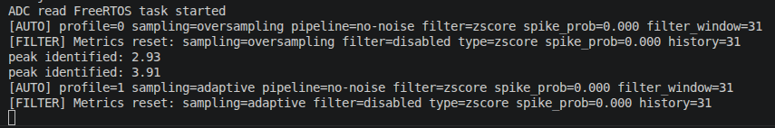
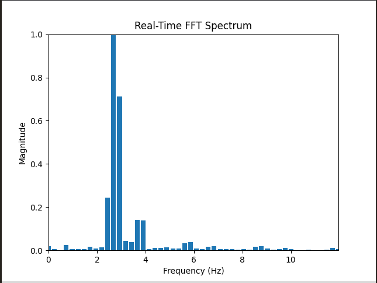
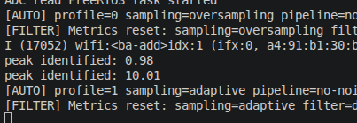
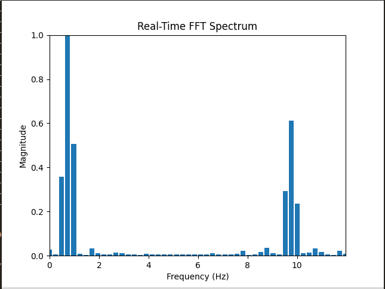

_note: the two images are not about the same moment since the tool used to create the plot of the FFT conflicts with the serial output so a small difference is visible_ 

### Noise section
The system is developed around the idea to analyze dinamycally the variation proposed by the assignment about the noise. I made to switch between 40 profiles to gather enough data in an aoutomatic and reproducible way.
The profiles are:
- {oversampling / no oversampling} x {no noise, noise} -> noise with fixed spiek probability at 0.05
- {oversampling / no oversampling} x noise x {hampel, z-score} {peak probability} {window size}
with peak probbaility as {0.01, 0.05, 0.10}
and window size as {5, 15, 31}
#### Noise addiction 
To have the possibility to calculate TPR and FPR for the filter identifier I implemented the addiction of the noise from the sampler and not the generator. This is counterintuitive and clearly degradates the system performance but it is the noly way to obtain true data since: clock syncronization was not available and the sampling rate is different from the generation rate, this would have the effect to make impossible knowing with confidence if a sample was read or not and so is impossible to determine its state.

##### Noise impact
The noise addiction without adding the filter did not alter the FFT computation since the condition for identify peaks showed to be strong enough to resist outliers and zero mean gaussian noise.
this implies that from the point of view of the network traffic nothing changed because the two frequency did not change.
#### Filters
The two chosen filters are: z-score and hampel filter, they work in a different way, hampel evaluate if a sample is an outlier using MAD (median absolute deviation) while z-score uses standard deviation.
The filters are implemented as a sliding window centered in the sample that is evaluated.

#### Performance impact 
##### Energy
We can see that the worst impact the add of the filter is on the adaptive sampling frequency.
**average current consumption for all filter configuration**
|label| 	mean current (mA)|
| -- | -- |
|500Hz |	142.9655             |
|10Hz| 	98.1486          |

**current consumption for different filter and windowsize**

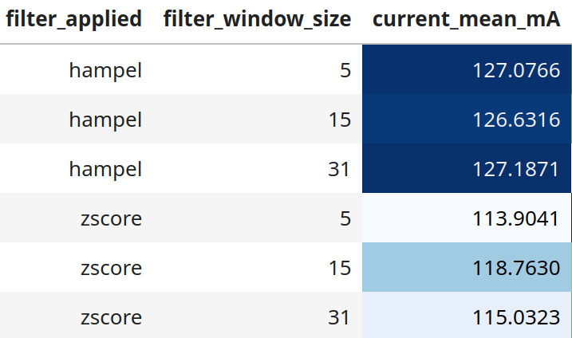

Here we can clearly see that the most expensive filter from current perspective is the hampel one, this is justified from its complexity since it is necessary to calculate the median absolute deviation.

##### Filter computing time
We can easily visualize the computing time of a filter in relation to the window size, this allow us to understan exactly why the energy consuption is different from one to another.

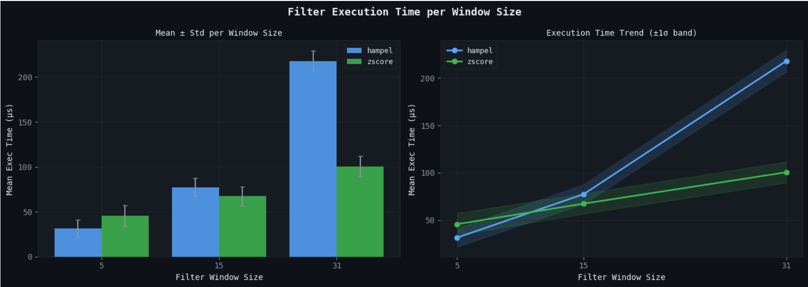

Clearly this would lead us to think that reducing the window size is the optimal solution but we need to verify wheter the accuracy of the filter is degrading. 

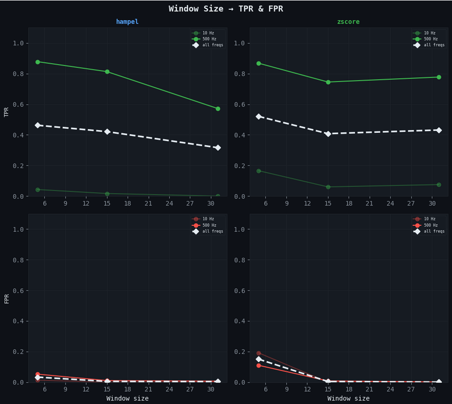

We can clearly see that the two performance follows different pattern, the fpr decreases as the window size increase for both as the most data means the possibility to evaluate better. The tpr does not increase but instead decrease, probably simptom of the gaussian component of the noise and since the signal is moving a greater window includes further value from the one evaluated. 

##### Filter performance
It is also interesting to understand how the spike probability probability influences the filter performance

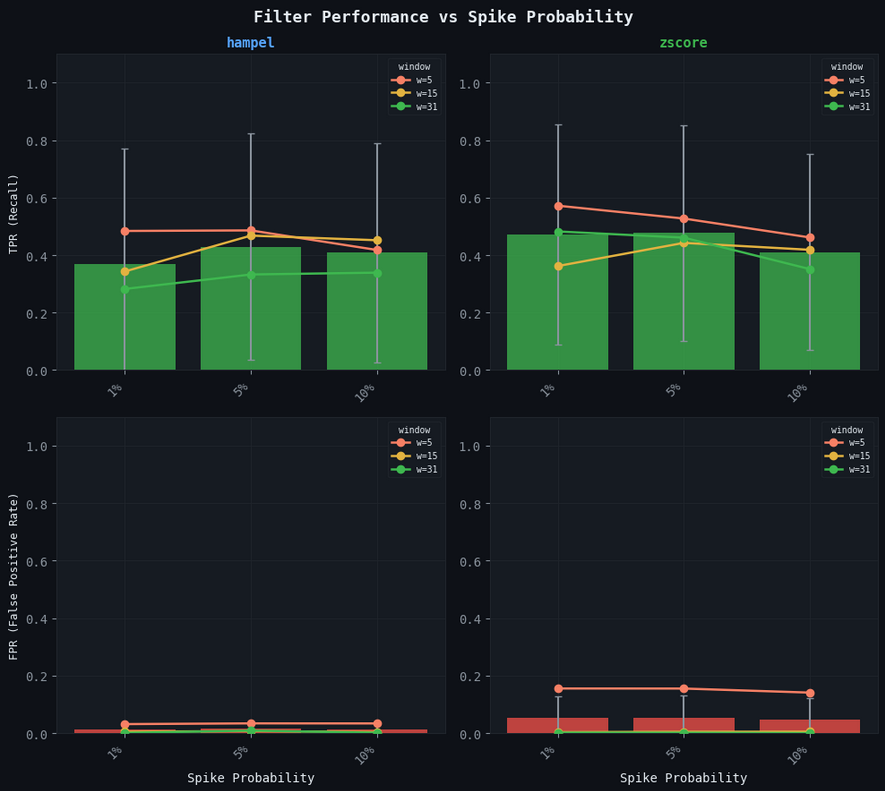

Here we notice som interesting things when the spike probability increase the hampel filter lower its tpr for two out of three window size while the hampel filter incerase for the medium and large window size but decreases for the lower one. The hampel filter clearly shows its dependency from the average value while the hampel filter is shown more robust when the window is large enough. 
##### Latency
The end to end latency is influenced by the filter execution time. As we've seen before we have the following formula to calculate end to end latency:
$$\text{latency} = RTT/2 + \text{filter computingtime} + \text{window computing time}$$

**execution time in relation to latency**

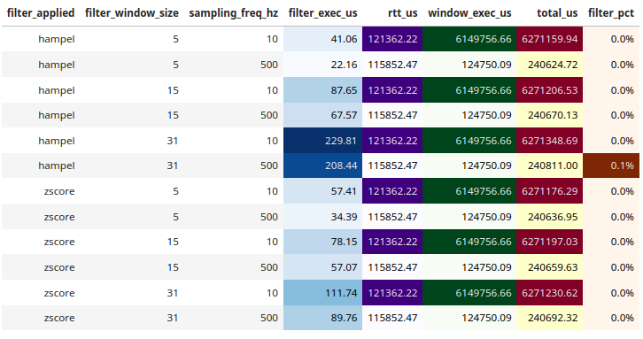

We can see how much is insignificant from the point o view of end to end latency since a tumbling window is involved and since I used an external broker which increased latency too.

## Use of LLM

### Prompts Used

Examples of prompts used during development:

* "Implement a FreeRTOS task for periodic ADC sampling on ESP32"
* "How to compute FFT using arduinoFFT library"
* "Implement Z-score anomaly detection in C++ with sliding window"
* "Compare Hampel filter vs Z-score in embedded systems"

### Generated Components

The LLM assisted in:

* Initial structure of FreeRTOS tasks
* FFT usage examples
* Basic filter implementations

### Evaluation of Code Quality

* Generated code was **syntactically correct**
* Required **manual optimization** for:

  * Memory usage
  * Real-time constraints
  * Integration with queues and interrupts

### Limitations

* LLM does not consider **real-time constraints**
* Suggested implementations were sometimes:

  * Inefficient (e.g., unnecessary copies)
  * Not hardware-aware
* Required **manual debugging and validation**

### Conclusion

The LLM was useful as a **development accelerator**, but not sufficient without strong domain knowledge and manual refinement.

## Reproducibility Guide

### Hardware Setup

* ESP32 Heltec LoRa V3 (sampler)
* ESP32 Wroom-32 (generator)
* INA219 current sensor
* External power supply

### Steps

1. **Flash Firmware**

   * Use PlatformIO
   * Upload generator and sampler code to respective boards

2. **Configure WiFi**

   * Set SSID and password in `secrets.h` 

3. **MQTT Setup**

   * Broker: HiveMQ
   * Topic: `tzn/data`
   * Run provided Python script to log data

4. **TTN Setup**

   * Register device on TTN
   * Configure keys in `secrets.h`

5. **Run System**

   * Power both boards
   * Hardware connection as in the hardware section
   * Monitor output via serial_plotter.py or MQTT client

6. **Data Analysis**

   * Use provided Python scripts:
    - `fft_plotter.py` to plot the fft dynamically during execution
    - `server.py` to receive ansd store MQTT received data
    - `serial_storer.py` to store data from the monitor
    - data analysis using `analysis.py`

### Notes

* Ensure stable WiFi connection
* Use same power supply for consistent energy measurements
## Appendix
### Appendix A Json Schema
```JSON
{  
"cnt":, //id
"t1":,
"mean":,
"window_exec_us":,
"sampling_freq_hz":,
"adaptive_sampling":,
"noise_enabled":,
"spike_probability":,
"filter_window_size":,
"auto_profile":,
"filter_applied":,
"filter_mean_exec_us":,
"tp":,
"tn":,
"fp":,
"fn":,
"previous_latency_us":,
}
```
